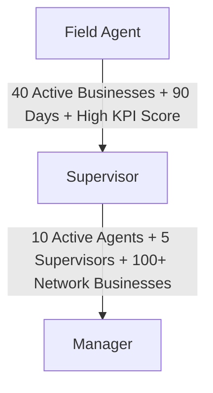

# One Partner Dashboard Structure

## Core Principle
Use **one unified Partner Dashboard** to prevent the operational complexity of managing separate dashboards for Affiliates, Agents, Supervisors, and Managers. Access control, layout customization, and features are differentiated dynamically using:
- **Roles**
- **Permissions**
- **Status**
- **KPIs**
- **Access Levels**

This single-system architecture is easier to maintain, update, scale, secure, analyze, and automate.

---

## User Types and Differentiation

Inside the Partner system, user differentiation is structured as follows:

| Role | Daily Reporting Target | Recruit Others | Override Earnings | Network Type | Description |
| :--- | :---: | :---: | :---: | :---: | :--- |
| **Affiliate** | No | Yes (Affiliates only) | No | Affiliate Network | Freelance/community marketers who recruit openly and build passive referral streams. |
| **Field Agent** | Yes | No | No | Field Operations | Operational workers who are interviewed and selected internally to execute day-to-day sales tasks. |
| **Supervisor** | Yes | Yes (Affiliates only) | Yes | Field Operations | Promoted Field Agents who manage small teams, oversee local territories, and recruit affiliates. |
| **Manager** | Yes | Yes | Yes | Field Operations | Senior operational leaders who oversee territories, manage supervisors, and may receive fixed allowances/salaries. |

---

## Network Types

The platform operates two distinct networks to separate freelance activity from professional sales operations:

### 1. Affiliate Network
- **Type**: Freelance referral system.
- **Access**: Open recruitment/registration.
- **Structure**: Passive-income structure focused on viral referral codes and community building.
- **Earning Rules**: Earn direct commission on personal referrals (Level 1) and indirect commission on sub-affiliate referrals (Level 2).

### 2. Field Operations Network
- **Type**: Controlled operational structure.
- **Access**: Interviewed and selected personnel only.
- **Structure**: High-accountability sales pipeline featuring daily reporting, strict KPIs, and explicit territory assignments.
- **Goal**: Maintain high-quality representation, reduce fraud risk, and scale controlled local distribution.

---

## Performance-Based Promotion Structure

To prevent uncontrolled expansion, fake growth, and low-quality recruitment, promotion inside the **Field Operations Network** is performance-based rather than referral-based.

### 1. Field Agent → Supervisor
Field Agents do **not** promote by recruiting sub-agents to earn overrides. Instead, they promote through personal operational performance:
- **Unlock Requirements**:
  - **40 Active Businesses** personally closed.
  - **90 Days Active** on the platform.
  - **Good Reporting Score** (consistent daily submissions).
  - **Attendance Consistency**.
  - **No Fraud Issues** (verified by system risk engine).
  - **Good Communication & Leadership Potential**.
- **Upgrade Process**: Vemtap Admin reviews metrics and upgrades them internally to Supervisor.
- **Supervisor Privileges**:
  - Supervise designated territories.
  - Manage local small teams.
  - Recruit freelance Affiliates (not agents).
  - Start earning team override commissions.

### 2. Supervisor → Manager
Supervisors advance to Manager by showing organizational growth and leadership capacity:
- **Unlock Requirements**:
  - **10 Active Agents** managed in their team.
  - **5 Supervisors** under their direct lineage.
  - **100+ Active Businesses** across their combined territory.
  - **Proven Operational Leadership**.
  - **Consistent Territory Management & Reporting**.
- **Upgrade Process**: Vemtap Admin upgrades them to Manager.
- **Manager Privileges**:
  - Oversee large multi-territory regions.
  - Receive operational support and leadership incentives.
  - Qualify for a fixed monthly allowance or salary structure.
