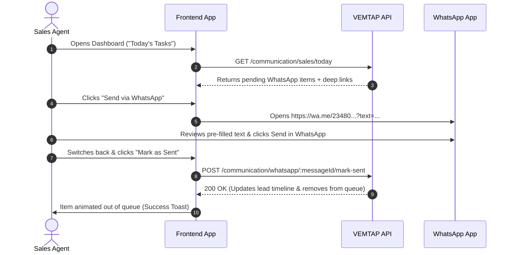

# VEMTAP Communication & Follow-up System — Complete Frontend API Documentation

This document is the definitive API reference and integration guide for the **VEMTAP Communication & Follow-up System**. It is designed for frontend engineers building the Admin Dashboard and Sales Portals (Affiliates, Agents, Supervisors, Managers, and Admins).

---

## Table of Contents

1. [Architecture & Core Concepts](#1-architecture--core-concepts)
2. [Authentication & Role Permissions](#2-authentication--role-permissions)
3. [Placeholders, Variables & SMS Constraints](#3-placeholders-variables--sms-constraints)
4. [Journey States & Message Statuses](#4-journey-states--message-statuses)
5. [Endpoints Reference](#5-endpoints-reference)
   - [5.1 Settings & Prohibited Words (`/communication/settings`)](#51-settings--prohibited-words-communicationsettings)
   - [5.2 Templates (`/communication/templates`)](#52-templates-communicationtemplates)
   - [5.3 Audience & Contact Filtering (`/communication/audience`)](#53-audience--contact-filtering-communicationaudience)
   - [5.4 Messages & Dispatch (`/communication/messages`)](#54-messages--dispatch-communicationmessages)
   - [5.5 WhatsApp Queue (`/communication/whatsapp`)](#55-whatsapp-queue-communicationwhatsapp)
   - [5.6 SMS Management (`/communication/sms`)](#56-sms-management-communicationsms)
   - [5.7 Automation Rules (`/communication/rules`)](#57-automation-rules-communicationrules)
   - [5.8 Campaigns (`/communication/campaigns`)](#58-campaigns-communicationcampaigns)
   - [5.9 Sales Rep "Today's Follow-ups" (`/communication/sales`)](#59-sales-rep-todays-follow-ups-communicationsales)
   - [5.10 Reporting & Analytics (`/communication/overview`, `/communication/reporting`)](#510-reporting--analytics-communicationoverview-communicationreporting)
6. [Frontend UI Implementation Guides](#6-frontend-ui-implementation-guides)

---

## 1. Architecture & Core Concepts

The Communication System enables seamless multi-channel outreach:

* **WhatsApp (Assisted Sending)**: Generates pre-rendered WhatsApp deep links (`https://wa.me/<phone>?text=<encoded_message>`). Sales reps click to open WhatsApp on their mobile device or desktop, send the message, and click **"Mark as Sent"**.
* **SMS (Automated & Admin-Controlled)**: Synchronously dispatches immediate SMS messages or schedules them via cron jobs. Includes daily spending caps, provider toggles, character assertions, and prohibited word filters.
* **Unified Pipeline**: Every outreach action creates a canonical `CommunicationMessage` record linked to a contact (`Lead`), tracking delivery status, timestamps, and sending agent.
* **Subscription Override Safety**: When a business registers and activates a paid subscription, all queued/pending lead-generation follow-ups are automatically cancelled (`CANCELLED`, reason: `Business subscribed — pending lead messages cancelled`).

---

## 2. Authentication & Role Permissions

### Base URL
`/api` (e.g. `http://localhost:3002/api` or production API gateway).

### Authentication
All requests require a valid JWT session via:
* **Cookie**: `access_token=<jwt>` (HttpOnly cookie set on login)
* **Header**: `Authorization: Bearer <jwt>`

### Role Scoping Matrix

| Role | WhatsApp Follow-ups | SMS Sending | Template CRUD | Automation & Campaigns | Scope / Data Visibility |
|---|---|---|---|---|---|
| `ADMIN`, `SUPER_ADMIN` | ✅ Yes | ✅ Full Control | ✅ Full CRUD | ✅ Full CRUD | **Global** (All leads, agents, reports) |
| `MANAGER`, `SUPERVISOR` | ✅ Yes | ❌ Blocked (403) | 👁️ Read-only | 👁️ Read-only | **Team** (Direct reports + own leads) |
| `AGENT`, `AFFILIATE`, `SALES_EXECUTIVE` | ✅ Yes | ❌ Blocked (403) | 👁️ Read-only | ❌ Blocked | **Own Leads Only** (Strict IDOR protection) |

---

## 3. Placeholders, Variables & SMS Constraints

### Supported Template Placeholders
The template engine dynamically replaces the following tokens during rendering:

| Placeholder | Context Source | Example Substitution |
|---|---|---|
| `[Business Name]` | `lead.businessName` | `ABC Supermarket` |
| `[Contact Name]` | `lead.contactName` | `Musa Ibrahim` |
| `[Area]` | `lead.location` | `Wuse II, Abuja` |
| `[Agent Name]` | `lead.user.fullName` | `John Doe` |

### SMS 160-Character Limit
* SMS messages are strictly enforced to **160 characters maximum**.
* **Template Creation Assertion**: Templates are validated against worst-case variable lengths upon creation.
* **Post-Variable Assertion**: Rendered SMS length is calculated **after** substituting contact data. Single sends exceeding 160 characters return `400 Bad Request`.

### Blacklisted / Prohibited Words
* Prohibited keywords/phrases are evaluated case-insensitively.
* Blocks saving SMS templates or sending SMS messages containing prohibited terms.
* All authenticated roles can fetch the blacklist via `GET /communication/settings/blacklisted-words`.

---

## 4. Journey States & Message Statuses

### Canonical Journey States (`JourneyState`)
* `NEW` — Newly submitted business/lead
* `CONTACTED` — Initial outreach made
* `VISITED` — Visited in the field
* `INTERESTED` — Expressed interest
* `FOLLOW_UP_REQUIRED` — Callback or scheduled meeting due
* `NOT_INTERESTED` — Dropped / declined
* `SUBSCRIBED` — Active paid VEMTAP customer
* `EXPIRED` — Lapsed customer (win-back target)
* `LOST_CLOSED` — Lead abandoned or closed out

### Communication Message Statuses (`CommunicationMessageStatus`)
* `PENDING` — Prepared for WhatsApp assisted send or queued for SMS
* `SCHEDULED` — Queued for future timestamp release
* `SENT` — Successfully sent or confirmed by sales rep
* `FAILED` — Provider error, SMS disabled, or validation failure
* `CANCELLED` — Cancelled manually or overridden by subscription

### Message Types (`CommunicationMessageType`)
* `MANUAL` — Rep-initiated individual or custom message
* `AUTOMATED` — Triggered by lifecycle rules
* `CAMPAIGN` — Broadcast campaign fan-out
* `WELCOME` — Post-subscription welcome message
* `CUSTOMER_JOURNEY` — Retention / renewal reminder

---

## 5. Endpoints Reference

---

### 5.1 Settings & Prohibited Words (`/communication/settings`)

#### 1. Fetch SMS Blacklisted Words (Public to All Authenticated Roles)
```http
GET /communication/settings/blacklisted-words
```
* **Roles**: All logged-in users (`AFFILIATE`, `AGENT`, `SUPERVISOR`, `MANAGER`, `SALES_EXECUTIVE`, `ADMIN`, `SUPER_ADMIN`).
* **Purpose**: Allows frontend composers to show client-side warnings or hints while typing.
* **Response `200 OK`**:
```json
{
  "blacklistedWords": ["scam", "promo50", "free_gift", "wire_transfer"]
}
```

---

#### 2. Get Global Communication Settings (Admin Only)
```http
GET /communication/settings
```
* **Roles**: `ADMIN`, `SUPER_ADMIN`
* **Response `200 OK`**:
```json
{
  "id": "c1f7b0f0-8c6e-4c7b-9c2b-2a2b0c1d2e3f",
  "smsEnabled": true,
  "smsProvider": "disabled",
  "smsSenderId": "VEMTAP",
  "smsDailyCap": 1000,
  "whatsappEnabled": true,
  "minIntervalHours": 24,
  "maxMessagesPerContactPerDay": 3,
  "maxMessagesPerContactPerWeek": 10,
  "notInterestedPolicy": "NO_MESSAGES",
  "reEngagementDelayDays": 30,
  "welcomeChannel": "SMS",
  "welcomeBody": "Welcome to VEMTAP! Your account is active.",
  "smsBlacklistedWords": ["scam", "crypto", "fraud"],
  "updatedAt": "2026-08-20T10:00:00.000Z"
}
```

---

#### 3. Update Communication Settings (Admin Only)
```http
PATCH /communication/settings
```
* **Roles**: `ADMIN`, `SUPER_ADMIN`
* **Request Body** (`UpdateCommunicationSettingsDto`):
```json
{
  "smsEnabled": true,
  "smsProvider": "disabled",
  "smsSenderId": "VEMTAP",
  "smsDailyCap": 1500,
  "whatsappEnabled": true,
  "minIntervalHours": 12,
  "maxMessagesPerContactPerDay": 4,
  "maxMessagesPerContactPerWeek": 12,
  "notInterestedPolicy": "ALLOW_CAMPAIGNS_AFTER_DELAY",
  "reEngagementDelayDays": 45,
  "welcomeChannel": "SMS",
  "welcomeBody": "Welcome to VEMTAP! Enjoy your service.",
  "smsBlacklistedWords": ["scam", "crypto", "fraud", "wire_transfer"]
}
```
* **Response `200 OK`**: Returns updated settings object.

---

### 5.2 Templates (`/communication/templates`)

#### 1. List Templates
```http
GET /communication/templates?channel=SMS&status=ACTIVE&search=welcome
```
* **Roles**: All logged-in roles
* **Query Parameters**:
  * `channel` (optional): `WHATSAPP` | `SMS`
  * `status` (optional): `ACTIVE` | `INACTIVE` | `ARCHIVED`
  * `search` (optional): Search query matching `name` or `body`
* **Response `200 OK`**:
```json
{
  "data": [
    {
      "id": "7b0a8813-865a-493a-86c3-18d4d7a22e0e",
      "name": "Interested Lead – First Follow-up (SMS)",
      "channel": "SMS",
      "body": "Hi [Business Name], thanks for your interest in VEMTAP. Would you like to get started?",
      "description": "First SMS follow-up for an interested lead.",
      "status": "ACTIVE",
      "createdById": "admin-uuid",
      "createdAt": "2026-08-19T22:02:19.000Z",
      "updatedAt": "2026-08-19T22:02:19.000Z"
    }
  ],
  "total": 1,
  "smsMaxLength": 160,
  "supportedVariables": ["[Business Name]", "[Contact Name]", "[Area]", "[Agent Name]"],
  "smsBlacklistedWords": ["scam", "crypto"]
}
```

---

#### 2. Get Single Template
```http
GET /communication/templates/:id
```
* **Roles**: All logged-in roles
* **Response `200 OK`**: Returns template object.

---

#### 3. Create Template (Admin Only)
```http
POST /communication/templates
```
* **Roles**: `ADMIN`, `SUPER_ADMIN`
* **Request Body** (`CreateCommunicationTemplateDto`):
```json
{
  "name": "Promo Follow-up",
  "channel": "SMS",
  "body": "Hi [Contact Name], get 20% off VEMTAP subscription this week!",
  "description": "Short promo SMS"
}
```
* **Validation Rules**:
  * For `channel === "SMS"`, body is evaluated against 160 chars and blacklisted words.
  * Throws `400 Bad Request` if over 160 chars or contains blacklisted words.
* **Response `201 Created`**: Returns created template object.

---

#### 4. Update Template (Admin Only)
```http
PATCH /communication/templates/:id
```
* **Roles**: `ADMIN`, `SUPER_ADMIN`
* **Request Body** (`UpdateCommunicationTemplateDto`):
```json
{
  "name": "Updated Promo Follow-up",
  "body": "Hi [Business Name], special discount available today!",
  "status": "ACTIVE"
}
```
* **Response `200 OK`**: Returns updated template object.

---

#### 5. Change Template Status (Admin Only)
```http
PATCH /communication/templates/:id/status
```
* **Roles**: `ADMIN`, `SUPER_ADMIN`
* **Request Body**:
```json
{
  "status": "ARCHIVED"
}
```
* **Response `200 OK`**: Returns updated template object.

---

### 5.3 Audience & Contact Filtering (`/communication/audience`)

#### 1. Preview Audience Match Count
```http
GET /communication/audience/preview?statuses=INTERESTED&statuses=VISITED&location=Wuse&hasPhone=true
```
* **Roles**: All logged-in roles (Non-admins are strictly filtered to their own assigned leads)
* **Query Parameters** (`AudiencePreviewDto`):
  * `statuses`: Array of `JourneyState` (e.g. `NEW`, `CONTACTED`, `INTERESTED`, etc.)
  * `salespersonIds`: Array of user UUIDs (Admin only; sales roles ignore this and scope to self)
  * `location`: String filter
  * `dateFilter`: `TODAY` | `THIS_WEEK` | `THIS_MONTH`
  * `startDate` / `endDate`: ISO Date strings
  * `hasPhone`: `true` | `false`
  * `includeEligibility`: `true` (optional, checks frequency & phone validity breakdown)
* **Response `200 OK`**:
```json
{
  "totalMatches": 42,
  "eligibleCount": 38,
  "skippedFrequency": 3,
  "missingPhone": 1
}
```

---

#### 2. List Audience Contacts
```http
GET /communication/audience/contacts?statuses=INTERESTED&page=1&limit=20
```
* **Roles**: All logged-in roles (Scoped to rep's own contacts for non-admins)
* **Query Parameters** (`AudienceFilterDto` & `ContactQueryDto`):
  * `statuses`, `location`, `hasPhone`, `dateFilter`, `startDate`, `endDate`
  * `page`: Integer (default: 1)
  * `limit`: Integer (default: 20)
  * `search`: String (searches business name, contact name, or phone)
* **Response `200 OK`**:
```json
{
  "data": [
    {
      "id": "lead-uuid",
      "businessName": "ABC Supermarket",
      "contactName": "Musa Ibrahim",
      "phone": "08012345678",
      "location": "Wuse II",
      "journeyState": "INTERESTED",
      "lastContactedAt": "2026-08-15T14:30:00.000Z",
      "nextFollowUpAt": "2026-08-21T09:00:00.000Z",
      "user": {
        "id": "rep-uuid",
        "fullName": "John Rep",
        "phone": "08099998888"
      }
    }
  ],
  "total": 42,
  "page": 1,
  "limit": 20
}
```

---

### 5.4 Messages & Dispatch (`/communication/messages`)

#### 1. Send / Queue Messages
```http
POST /communication/messages
```
* **Roles**: All logged-in roles
  * Non-admins: Restricted to `channel: "WHATSAPP"` (attempts to send SMS return `403 Forbidden`).
  * Admins: Can send `WHATSAPP` and `SMS`.
* **Request Body** (`SendMessageDto`):
```json
{
  "channel": "WHATSAPP",
  "body": "Hi [Business Name], this is [Agent Name] from VEMTAP following up on your demo.",
  "leadIds": ["lead-uuid-1", "lead-uuid-2"],
  "templateId": "template-uuid",
  "scheduledForAt": null
}
```
*Alternative: Audience-based broadcast (instead of `leadIds`)*:
```json
{
  "channel": "SMS",
  "body": "Hi [Business Name], special renewal discount for VEMTAP!",
  "audience": {
    "statuses": ["EXPIRED"],
    "hasPhone": true
  }
}
```
* **Response `201 Created`**:
```json
{
  "created": 2,
  "skipped": 0,
  "noPhone": 0,
  "channelDisabled": 0,
  "tooLong": 0,
  "blacklisted": 0,
  "messages": ["msg-uuid-1", "msg-uuid-2"],
  "dispatched": [
    {
      "leadId": "lead-uuid-1",
      "messageId": "msg-uuid-1",
      "status": "PENDING"
    }
  ],
  "outcomes": [
    { "leadId": "lead-uuid-1", "outcome": "created", "messageId": "msg-uuid-1" },
    { "leadId": "lead-uuid-2", "outcome": "created", "messageId": "msg-uuid-2" }
  ]
}
```

---

#### 2. List Messages & History
```http
GET /communication/messages?channel=WHATSAPP&status=PENDING&page=1&limit=25
```
* **Roles**: All logged-in roles (Non-admins see only messages for their leads)
* **Query Parameters** (`MessageQueryDto`):
  * `channel`: `WHATSAPP` | `SMS`
  * `status`: `PENDING` | `SCHEDULED` | `SENT` | `FAILED` | `CANCELLED`
  * `type`: `MANUAL` | `AUTOMATED` | `CAMPAIGN` | `WELCOME` | `CUSTOMER_JOURNEY`
  * `leadId`: UUID
  * `campaignId`: UUID
  * `page`, `limit`
* **Response `200 OK`**:
```json
{
  "data": [
    {
      "id": "msg-uuid",
      "channel": "WHATSAPP",
      "type": "MANUAL",
      "status": "PENDING",
      "phone": "08012345678",
      "body": "Hi ABC Restaurant, thanks for your interest...",
      "variables": {
        "businessName": "ABC Restaurant",
        "contactName": "John",
        "location": "Maitama",
        "agentName": "Agent Sarah"
      },
      "scheduledForAt": null,
      "sentAt": null,
      "failureReason": null,
      "lead": {
        "id": "lead-uuid",
        "businessName": "ABC Restaurant",
        "contactName": "John",
        "journeyState": "INTERESTED"
      },
      "createdAt": "2026-08-20T10:15:00.000Z"
    }
  ],
  "total": 1,
  "page": 1,
  "limit": 25
}
```

---

#### 3. 360° Contact Communication Profile
```http
GET /communication/messages/contacts/:leadId
```
* **Roles**: All logged-in roles (Own leads only for non-admins)
* **Response `200 OK`**:
```json
{
  "lead": {
    "id": "lead-uuid",
    "businessName": "ABC Restaurant",
    "contactName": "John Doe",
    "phone": "08012345678",
    "location": "Maitama",
    "journeyState": "INTERESTED",
    "lastContactedAt": "2026-08-18T10:00:00.000Z",
    "nextFollowUpAt": "2026-08-21T09:00:00.000Z"
  },
  "messages": [
    {
      "id": "msg-uuid-1",
      "channel": "SMS",
      "type": "AUTOMATED",
      "status": "SENT",
      "body": "Welcome to VEMTAP!",
      "sentAt": "2026-08-18T10:00:05.000Z"
    }
  ],
  "totalMessages": 1,
  "channelBreakdown": {
    "WHATSAPP": 0,
    "SMS": 1
  },
  "statusBreakdown": {
    "SENT": 1,
    "PENDING": 0,
    "FAILED": 0
  }
}
```

---

#### 4. Manually Trigger Scheduled SMS (Admin Only)
```http
POST /communication/messages/:id/send
```
* **Roles**: `ADMIN`, `SUPER_ADMIN`
* **Response `200 OK`**: Returns updated message record (`status: "SENT"` or `"FAILED"`).

---

#### 5. Cancel Message (Admin Only)
```http
PATCH /communication/messages/:id/cancel
```
* **Roles**: `ADMIN`, `SUPER_ADMIN`
* **Response `200 OK`**: Returns message record with `status: "CANCELLED"`.

---

### 5.5 WhatsApp Queue (`/communication/whatsapp`)

#### 1. Fetch WhatsApp Follow-up Queue
```http
GET /communication/whatsapp/queue?leadId=optional-lead-uuid
```
* **Roles**: All logged-in sales roles & admins
* **Purpose**: Powers the Sales Rep Assisted-Sending interface. Returns pre-rendered WhatsApp deep links.
* **Response `200 OK`**:
```json
{
  "data": [
    {
      "messageId": "msg-uuid",
      "leadId": "lead-uuid",
      "businessName": "ABC Supermarket",
      "contactName": "Musa Ibrahim",
      "phone": "08012345678",
      "normalizedPhone": "2348012345678",
      "location": "Wuse II",
      "journeyState": "INTERESTED",
      "body": "Hi ABC Supermarket, thanks for your interest in VEMTAP. Let us know if you have questions.",
      "whatsAppLink": "https://wa.me/2348012345678?text=Hi%20ABC%20Supermarket%2C%20thanks%20for%20your%20interest%20in%20VEMTAP.%20Let%20us%20know%20if%20you%20have%20questions.",
      "preparedAt": "2026-08-20T08:00:00.000Z",
      "status": "PENDING"
    }
  ],
  "total": 1
}
```

---

#### 2. Mark WhatsApp Message as Sent
```http
POST /communication/whatsapp/:messageId/mark-sent
```
* **Roles**: All logged-in sales roles & admins (IDOR protected: reps can only mark messages for their own leads)
* **Purpose**: Called when the sales rep clicks the "Sent" confirmation button in the UI after dispatching in WhatsApp.
* **Behavior**:
  * Updates message `status` to `SENT`.
  * Sets `sentAt` to `now()`.
  * Records `sentById` to current user.
  * Updates lead's `lastContactedAt` to `now()`.
* **Response `200 OK`**:
```json
{
  "id": "msg-uuid",
  "status": "SENT",
  "sentAt": "2026-08-20T10:20:00.000Z",
  "sentById": "rep-uuid"
}
```

---

### 5.6 SMS Management (`/communication/sms`)

#### 1. List SMS Logs & History
```http
GET /communication/sms?status=FAILED&page=1&limit=20
```
* **Roles**: All logged-in roles
* **Response `200 OK`**: Returns paginated list of SMS messages.

---

#### 2. Retry Failed SMS (Admin Only)
```http
POST /communication/sms/:id/retry
```
* **Roles**: `ADMIN`, `SUPER_ADMIN`
* **Request Body** (optional): `{ "force": true }`
* **Response `200 OK`**: Re-attempts delivery through active provider and returns updated message.

---

### 5.7 Automation Rules (`/communication/rules`)

*Admin-only automated sequences that fire on lifecycle triggers (e.g. Lead Created, Visited, Expired).*

#### 1. List Automation Rules
```http
GET /communication/rules
```
* **Roles**: `ADMIN`, `SUPER_ADMIN`
* **Response `200 OK`**:
```json
[
  {
    "id": "rule-uuid",
    "name": "New Lead Welcome SMS",
    "trigger": "LEAD_CREATED",
    "condition": null,
    "waitDays": 0,
    "action": "SEND_SMS",
    "channel": "SMS",
    "templateId": "template-uuid",
    "isActive": true,
    "sortOrder": 1,
    "template": {
      "id": "template-uuid",
      "name": "Lead Welcome",
      "body": "Welcome to VEMTAP!"
    }
  }
]
```

---

#### 2. Create Automation Rule
```http
POST /communication/rules
```
* **Roles**: `ADMIN`, `SUPER_ADMIN`
* **Request Body** (`CreateAutomationRuleDto`):
```json
{
  "name": "Interested 3-Day WhatsApp Task",
  "trigger": "LEAD_STATUS_CHANGED",
  "condition": { "toStatus": "INTERESTED" },
  "waitDays": 3,
  "action": "CREATE_WHATSAPP_TASK",
  "channel": "WHATSAPP",
  "templateId": "template-uuid",
  "isActive": true,
  "sortOrder": 2
}
```
* **Supported Triggers (`AutomationTrigger`)**:
  * `LEAD_CREATED`
  * `LEAD_STATUS_CHANGED`
  * `MARKET_MAPPING_VISITED`
  * `FIELD_ACTIVITY_CAPTURED`
  * `SUBSCRIPTION_ACTIVATED`
  * `BEFORE_EXPIRY`
  * `AFTER_EXPIRY`
  * `INACTIVITY_DETECTED`
* **Supported Actions (`AutomationAction`)**:
  * `CREATE_WHATSAPP_TASK`
  * `SEND_SMS`
  * `CHANGE_LEAD_STATUS`
  * `NOTIFY_AGENT`
* **Response `201 Created`**: Returns created rule object.

---

#### 3. Update Rule & Reorder
* `PATCH /communication/rules/:id` — Update fields
* `PATCH /communication/rules/:id/activate` — Set `isActive: true`
* `PATCH /communication/rules/:id/deactivate` — Set `isActive: false`
* `DELETE /communication/rules/:id` — Delete rule
* `PATCH /communication/rules/reorder` — `{ "order": ["rule-uuid-1", "rule-uuid-2"] }`

---

### 5.8 Campaigns (`/communication/campaigns`)

#### 1. List Campaigns
```http
GET /communication/campaigns?status=ACTIVE
```
* **Roles**: `ADMIN`, `SUPER_ADMIN`

---

#### 2. Create Campaign
```http
POST /communication/campaigns
```
* **Roles**: `ADMIN`, `SUPER_ADMIN`
* **Request Body** (`CreateCampaignDto`):
```json
{
  "name": "Lapsed Customer Win-Back",
  "description": "SMS and WhatsApp outreach for expired businesses",
  "channels": ["SMS", "WHATSAPP"],
  "templateId": "template-uuid",
  "audienceFilters": {
    "statuses": ["EXPIRED"],
    "hasPhone": true
  },
  "startAt": "2026-09-01T08:00:00.000Z",
  "endAt": "2026-09-07T18:00:00.000Z"
}
```
* **Response `201 Created`**: Returns campaign object in `DRAFT` status.

---

#### 3. Activate / Control Campaign Lifecycle
```http
PATCH /communication/campaigns/:id/status
```
* **Roles**: `ADMIN`, `SUPER_ADMIN`
* **Request Body**:
```json
{
  "action": "ACTIVE"
}
```
* **Actions**: `ACTIVE` | `PAUSED` | `COMPLETED` | `CANCELLED`
* **Behavior on `ACTIVE`**: Instantly fans out messages to matching audience (or schedules them if `startAt` is in the future).

---

### 5.9 Sales Rep "Today's Follow-ups" (`/communication/sales`)

#### 1. Get Today's Actionable Queue
```http
GET /communication/sales/today
```
* **Roles**: `AFFILIATE`, `AGENT`, `SUPERVISOR`, `MANAGER`, `SALES_EXECUTIVE`, `ADMIN`, `SUPER_ADMIN`
* **Purpose**: Primary dashboard widget for sales representatives.
* **Returns**:
  1. `pendingWhatsApp`: Ready-to-send WhatsApp messages for today with generated click-to-chat links.
  2. `scheduledFollowUps`: Leads where `nextFollowUpAt` is due today.
  3. `staleLeads`: Leads not contacted in > 7 days that require re-engagement.
* **Response `200 OK`**:
```json
{
  "summary": {
    "totalPendingWhatsApp": 5,
    "totalScheduledFollowUps": 2,
    "totalStaleLeads": 8
  },
  "pendingWhatsApp": [
    {
      "messageId": "msg-uuid",
      "leadId": "lead-uuid",
      "businessName": "Mega Bites",
      "contactName": "Chidi",
      "phone": "08033334444",
      "body": "Hi Mega Bites, let's finalize your VEMTAP setup.",
      "whatsAppLink": "https://wa.me/2348033334444?text=Hi%20Mega%20Bites...",
      "preparedAt": "2026-08-20T08:00:00.000Z"
    }
  ],
  "scheduledFollowUps": [
    {
      "id": "lead-uuid-2",
      "businessName": "Downtown Cafe",
      "contactName": "Aisha",
      "phone": "08055556666",
      "nextFollowUpAt": "2026-08-20T14:00:00.000Z"
    }
  ],
  "staleLeads": [
    {
      "id": "lead-uuid-3",
      "businessName": "Sunset Lounge",
      "lastContactedAt": "2026-08-10T11:00:00.000Z"
    }
  ]
}
```

---

### 5.10 Reporting & Analytics (`/communication/overview`, `/communication/reporting`)

#### 1. Communication Overview Totals
```http
GET /communication/overview
```
* **Roles**: `ADMIN`, `SUPER_ADMIN`
* **Response `200 OK`**:
```json
{
  "overview": {
    "totalContacts": 1250,
    "byChannel": {
      "WHATSAPP": 820,
      "SMS": 430
    },
    "byStatus": {
      "SENT": 1100,
      "PENDING": 90,
      "SCHEDULED": 30,
      "FAILED": 20,
      "CANCELLED": 10
    },
    "smsDailyCap": 1000,
    "smsSentToday": 142
  }
}
```

---

#### 2. Conversion & Performance Report
```http
GET /communication/reporting?channel=SMS&from=2026-08-01&to=2026-08-31
```
* **Roles**: `ADMIN`, `SUPER_ADMIN`
* **Response `200 OK`**:
```json
{
  "conversion": {
    "totalContacted": 430,
    "subscribedAfterOutreach": 86,
    "conversionRate": "20.00%"
  },
  "volumeByDate": [
    { "date": "2026-08-15", "count": 45 },
    { "date": "2026-08-16", "count": 62 }
  ]
}
```

---

## 6. Frontend UI Implementation Guides

### 6.1 Sales Rep Daily Flow (Assisted WhatsApp)


---

### 6.2 Message Composer Validation Rules (Client-Side)

When building the message composer modal:

```typescript
// Example Client-Side Character & Blacklist Guard
function validateMessage(
  body: string,
  channel: 'WHATSAPP' | 'SMS',
  blacklistedWords: string[],
): { valid: boolean; error?: string; length: number } {
  if (channel === 'SMS') {
    if (body.length > 160) {
      return {
        valid: false,
        error: `Message exceeds 160 characters (${body.length}/160)`,
        length: body.length,
      };
    }

    const lowerBody = body.toLowerCase();
    for (const word of blacklistedWords) {
      if (word.trim() && lowerBody.includes(word.trim().toLowerCase())) {
        return {
          valid: false,
          error: `Message contains prohibited word: "${word.trim()}"`,
          length: body.length,
        };
      }
    }
  }

  return { valid: true, length: body.length };
}
```

---

### 6.3 Standard HTTP Error Responses

All error responses from the backend adhere to the standard NestJS exception schema:

```json
{
  "statusCode": 400,
  "message": "Message contains prohibited word/phrase: \"scam\".",
  "error": "Bad Request"
}
```

Common status codes:
* `400 Bad Request` — Validation failure (160 characters exceeded, blacklisted word found, invalid phone number).
* `401 Unauthorized` — Missing or expired JWT session.
* `403 Forbidden` — Sales role attempting to send SMS or accessing other agents' contact records (IDOR guard).
* `404 Not Found` — Requested lead, template, rule, or campaign does not exist.
